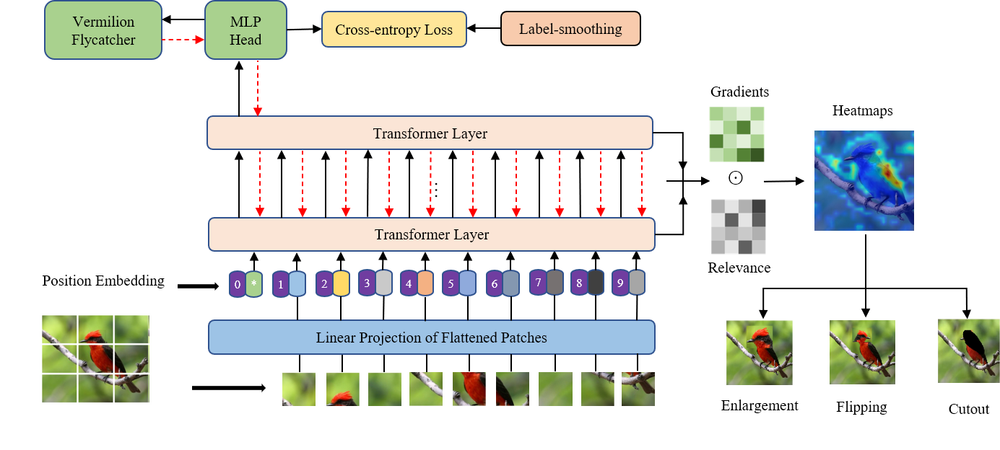

# Data Augmentations based on the ViT's High-response Areas for Fine-grained Visual Classification

This is a Pytorch implement for our paper:  Data Augmentations based on the ViT's High-response Areas for Fine-grained Visual Classification

## Framework

## Environment

>- Python 3.6.8
>-   Pytorch 1.9.0
>-   RTX3080   (RTX2070 for Stanford Dogs)

## Dataset
We conduct our method on five popular fine-grained benchmarks.
>- [CUB_200_2011](http://www.vision.caltech.edu/visipedia/CUB-200-2011.html)
>-    [NABirds](https://dl.allaboutbirds.org/nabirds)
>-    [Stanford Cars](https://ai.stanford.edu/~jkrause/cars/car_dataset.html)
>-    [Stanford Dogs](http://vision.stanford.edu/aditya86/ImageNetDogs/)
>-    [Oxford FLowers](https://www.robots.ox.ac.uk/~vgg/data/flowers/102/)

## Usage
### 1.  Install required packages
Install dependencies with the following command:
```bash
pip install -r requirements.txt
```
###  2.Train
1. Train an initial model based on the original datasets.
2. Generate heatmaps using:
```bash
cd heatmaps
python CUB_heatmaps.py --root_path home/data/CUB_200_2011 --model_path /home/model/vit_pretrained.pth
```
3. To train the CUB_200_2011 with 8 batch_size for 50 epochs run:
```bash
cd ..
python train.py --dataset CUB_200_2011 --datapath data/CUB_200_2011  --epochs 50 --batch_size 8
```
## Performance
|Dataset | Category | Training | Testing |Accuracy(%)|
|:----------:|:---------:|:---------:|:---------:|:---------:|
|CUB-200-2011|200|5994|5794|91.8|
|NABirds|555|23929|24633|91.2|
|Stanford Cars|196|8144|8041|93.8|
|Stanford Dogs|120|12000|8580|93.2|
|Oxford Flowers|102|1020|6149|99.6|

## Models
The models (.pth) of these five datasets can be download [here](https://pan.baidu.com/share/init?surl=F6GOBNSBX5T2oBIfHSbWgg), the password is 1234.

## Acknowledgement
Many thanks to the [timm](https://github.com/rwightman/pytorch-image-models) package,  [visualization method of transformer](https://github.com/hila-chefer/Transformer-Explainability), and [TransFG](https://github.com/TACJu/TransFG).
